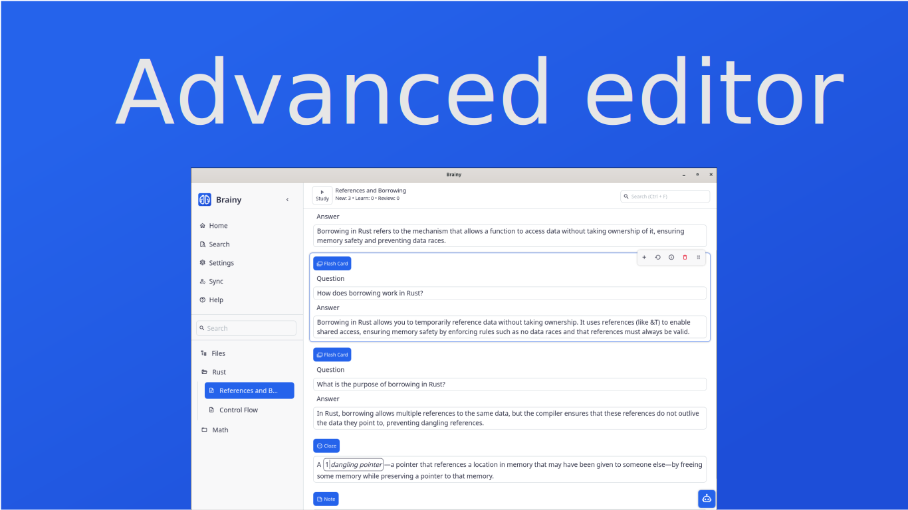
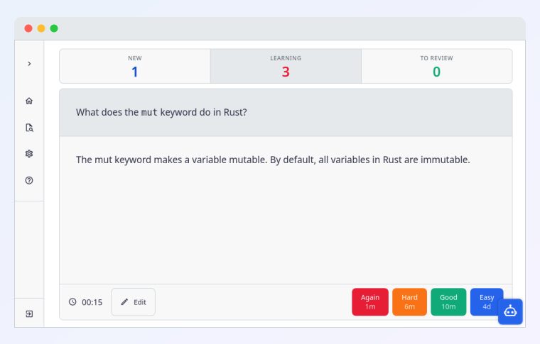
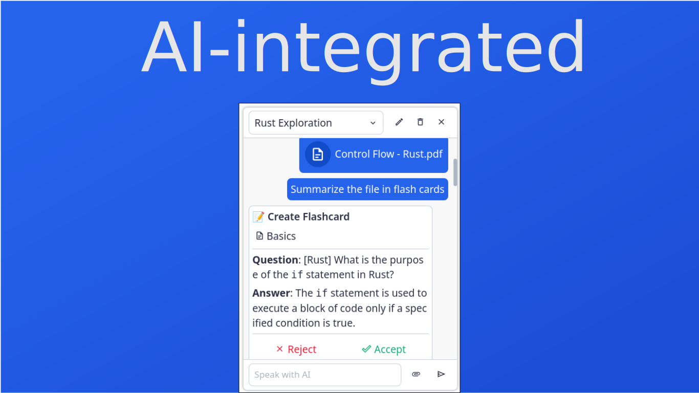

<h1 align="center" style="border-bottom: none">
    
    <b> Brainy</b>
</h1>

    Open-source, AI-integrated learning app built around spaced repetition

    <a href="https://github.com/brainylearn/brainy-app/releases">⬇️ Download</a> •
    <a href="https://discord.gg/H9bEfqDb8a">💬 Join the Discord</a> •
    <a href="https://www.reddit.com/r/brainy_learn/">🤝 Reddit</a>

---

## 📸 Screenshots

    
    
    

---

## ⚡ What makes Brainy different?

- **🧠 Spaced Repetition** — Powered by the FSRS algorithm, Brainy adapts to how well you know each card and schedules reviews at the perfect moment
- **🎯 Multiple study formats** — Flashcards, cloze deletions, and more
- **🤖 AI-generated study materials** — Drop in a PDF, textbook, or lecture notes and let Brainy turn them into a ready-to-study card set instantly
- **📓 Notebook-style organization** — Organize your cards in a familiar notebook and folder structure, just like your notes
- **✨ Clean, intuitive interface** — A thoughtfully designed UI that stays out of your way so you can focus on learning
- **☁️ Synced across devices** — Your progress follows you everywhere
- **💾 Automatic backups** — Your data is always safe

---

## 🐛 Issues & Feedback

[Open an issue](https://github.com/brainylearn/brainy-app/issues/new)

---

## 📄 License

This project is licensed under the GNU Affero General Public License v3.0
(AGPL-3.0). See the [LICENSE](./LICENSE) file for details.
